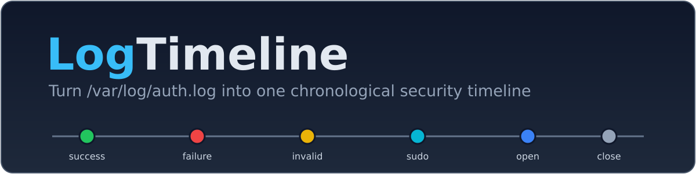
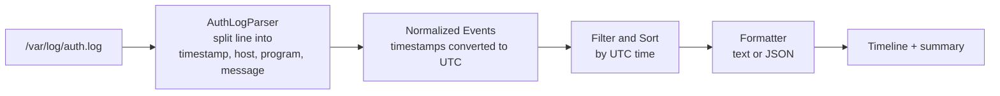

<p align="center">
  
</p>

<p align="center">
  <strong>Read your Linux auth log. See what happened, in order, in UTC.</strong><br>
  A small, dependency-free command-line tool that turns <code>/var/log/auth.log</code>
  into one clean, chronological timeline of security events.
</p>

<p align="center">
  
  
  
  
  
</p>

<p align="center">
  <a href="#overview">Overview</a> &middot;
  <a href="#quick-start">Quick Start</a> &middot;
  <a href="#usage">Usage</a> &middot;
  <a href="#example-output">Example Output</a> &middot;
  <a href="#how-it-works">How It Works</a> &middot;
  <a href="#security-notes">Security Notes</a> &middot;
  <a href="#roadmap">Roadmap</a>
</p>

---

## Overview

When you are investigating a Linux machine, the authentication log holds the
story — who logged in, who failed, who ran `sudo` — but it is noisy, mixed in
with everything else, and its timestamps can carry a timezone offset that is
not even your own. `LogTimeline` reads that log and gives you back a single,
ordered, UTC-normalized timeline of just the security-relevant events.

**Before** — raw `auth.log` lines (note the `-04:00` offset):

```text
2026-10-08T07:38:10.100000-04:00 kali sshd[1200]: Accepted password for kali from 192.0.2.10 port 51514 ssh2
2026-10-08T07:39:05.300000-04:00 kali sudo:     kali : TTY=pts/0 ; PWD=/home/kali ; USER=root ; COMMAND=/usr/bin/apt update
2026-10-08T07:39:51.894612-04:00 kali sudo: pam_unix(sudo:session): session closed for user root
```

**After** — `python3 LogTimeline.py` (converted to UTC, one line per event):

```text
2026-10-08 11:38:10Z  SshLoginSuccess   user=kali ip=192.0.2.10 port=51514
2026-10-08 11:39:05Z  SudoCommand       user=kali cmd=/usr/bin/apt update
2026-10-08 11:39:51Z  SessionClosed     user=root
```

---

## Features

- **One chronological timeline** of SSH logins, failed logins, invalid users,
  `sudo` commands, `sudo` auth failures, and session open/close events.
- **UTC normalization.** Every timestamp is converted to UTC before sorting, so
  a log with mixed offsets still comes out in the true order of events.
- **Text or JSON output.** Human-readable with color, or machine-readable for
  piping into other tools.
- **Filtering** by time window (`--since` / `--until`) and by event type
  (`--type`, repeatable).
- **Elapsed-time gaps** with `--show-gaps`, making pauses and bursts visible
  between consecutive events in the filtered timeline.
- **A summary footer** — lines read, events recognized, lines skipped, time
  range, and a count per event type.
- **Safe by design.** Read-only, no shell-outs, no network, and hostile log
  content is neutralized before it ever reaches your terminal.
- **Zero dependencies.** Pure Python standard library. Clone and run.

---

## Supported Systems

v0.1 is defined **by capability, not by distro name**: it supports *any Linux
system with a readable `/var/log/auth.log` in ISO 8601 format*. Full details and
a 30-second self-check are in [`Docs/SupportedSystems.md`](Docs/SupportedSystems.md).

| System | Status | Notes |
| --- | --- | --- |
| **Kali Linux** (with `auth.log`) |  Tested | Verified by the author (Kali in a VM). Reference platform. |
| **Ubuntu** |  Untested, expected to work if `auth.log` exists | Not verified by the author — reports welcome. |
| **Parrot OS** |  Untested, expected to work if `auth.log` exists | Not verified by the author — reports welcome. |
| **Debian 12+** |  Not supported yet (journal-only by default) | No `auth.log` unless `rsyslog` is installed. |
| **Arch Linux** |  Not supported yet (journal-only by default) | No `auth.log` unless a syslog daemon is installed. |
| **systemd journal** |  Planned (v0.2) | Reading journald directly is the next milestone. |

---

## Quick Start

```bash
git clone https://github.com/Antech-greyhat/LogTimeline.git
cd LogTimeline
python3 LogTimeline.py
```

That reads `/var/log/auth.log`. **No root required** to start — if the file is
not readable, the tool tells you exactly why.

### Try it now (works on any machine, no real log needed)

The repository ships synthetic sample logs, so you can see it work immediately:

```bash
# A quiet, ordinary day
python3 LogTimeline.py --file Samples/AuthLogNormal.log

# A brute-force burst followed by a successful login
python3 LogTimeline.py --file Samples/AuthLogBruteForce.log

# Hostile input: odd usernames and control characters, safely neutralized
python3 LogTimeline.py --file Samples/AuthLogHostile.log
```

---

## Usage

```text
python3 LogTimeline.py [options]
```

| Flag | Purpose | Example |
| --- | --- | --- |
| `--file PATH` | Log file to read (default `/var/log/auth.log`) | `--file Samples/AuthLogNormal.log` |
| `--since DATE` | Only events at or after this ISO date/datetime (no timezone means UTC) | `--since 2026-10-08` |
| `--until DATE` | Only events at or before this ISO date/datetime | `--until 2026-10-08T12:00:00Z` |
| `--type NAME` | Only this event type; repeat for several | `--type SshLoginFailure --type SudoCommand` |
| `--format {text,json}` | Output format (default `text`) | `--format json` |
| `--output PATH` | Write to a file instead of the terminal | `--output timeline.txt` |
| `--local` | Show times in the machine's local timezone (text output only) | `--local` |
| `--show-gaps` | Show elapsed time since the previous event (text output only) | `--show-gaps` |
| `--no-color` | Disable colors (also off when piped or when `NO_COLOR` is set) | `--no-color` |
| `--version` | Print the version and exit | `--version` |
| `-h`, `--help` | Show the full help | `--help` |

Valid `--type` names: `SshLoginSuccess`, `SshLoginFailure`, `SshInvalidUser`,
`SudoCommand`, `SudoAuthFailure`, `SessionOpened`, `SessionClosed`.

**Exit codes:** `0` success · `1` a runtime/input problem (bad file, bad date,
no events) · `2` a command-line usage error.

---

## Example Output

Running against the brute-force sample. Note the successful login: its line is
written **first** in the file (with a `+03:00` offset) but, once converted to
UTC, it correctly appears near the **end** of the attack — exactly the kind of
ordering a raw log hides.

```text
2026-10-08 10:00:01Z  SshLoginFailure   user=kali ip=198.51.100.7 port=40001
2026-10-08 10:00:02Z  SshLoginFailure   user=kali ip=198.51.100.7 port=40002
2026-10-08 10:00:03Z  SshLoginFailure   user=admin ip=203.0.113.5 port=40003
2026-10-08 10:00:03Z  SshInvalidUser    user=admin ip=203.0.113.5 port=40003
2026-10-08 10:00:04Z  SshLoginFailure   user=root ip=203.0.113.5 port=40004
2026-10-08 10:00:05Z  SshLoginSuccess   user=kali ip=198.51.100.7 port=40010
2026-10-08 10:00:06Z  SshLoginFailure   user=kali ip=198.51.100.7 port=40011

Summary
-------
Lines read:        7
Events recognized: 7
Lines skipped:     0
Time range:        2026-10-08 10:00:01Z  ->  2026-10-08 10:00:06Z
By event type:
  SshLoginSuccess  1
  SshLoginFailure  5
  SshInvalidUser   1
```

Add `--show-gaps` to put the time since the previous displayed event beside
each row. The first row is marked `—`; later rows show intervals such as
`+00:00:01` or `+1d02:03:04`. Gaps are calculated after filtering, so they
describe the events visible in the current view.

The same data as JSON (`--format json`) gives one object per event with the
full schema (`TimestampUtc`, `Host`, `Program`, `EventType`, `User`,
`SourceIp`, `Port`, `Command`, `RawLine`) plus a `summary` block — ready to pipe
into `jq` or another tool.

---

## How It Works



**Why UTC normalization matters.** The author's machine is in Kenya (UTC+3), but
its logs are written with a `-04:00` offset. A line stamped `07:39:51-04:00` is
really `11:39:51` UTC, while a line stamped `10:00:00+03:00` is really
`07:00:00` UTC — *earlier*, even though its wall-clock time looks later. If you
sorted on the text as written, those two events would come out in the wrong
order. By converting every timestamp to a single reference (UTC) before
sorting, LogTimeline always shows the true sequence of events — which is the
whole point of a timeline.

---

## Security Notes

LogTimeline is a defensive tool and is built to be safe to point at a log you do
not fully trust:

- **Read-only.** Logs are opened in read mode only. The tool never writes to,
  deletes, or appends to a source log, and never needs `sudo` to start.
- **No shell-outs, no network.** It never calls `subprocess`, `os.system`,
  `eval`, `exec`, or `pickle`, and it makes no network connections. It only
  reads the file you give it.
- **Hostile input is neutralized.** Usernames and commands in a log are
  **attacker-controlled** — an attacker picks the username they try to log in
  with. If such a field contained raw ANSI escape sequences or control
  characters, printing it could tamper with your terminal ("terminal
  injection"). LogTimeline replaces every control character with a visible
  `\xNN` form before display, so an escape sequence shows up as harmless text
  like `\x1b[2J` instead of running. JSON output is built with Python's `json`
  module, which escapes control characters automatically.
- **Encoding safety.** Files are read with `errors="replace"`, so a single
  malformed byte can never crash the tool.
- **Privacy.** Real logs contain real usernames, IP addresses and hostnames.
  **Do not paste real log contents into public issues.** Scrub them first, or
  use the documentation-reserved values shown in the samples.
- **Authorization.** Only analyze logs you are authorized to read. This tool is
  for your own systems and for authorized engagements — not for logs you have no
  right to access.

---

## Project Structure

```text
LogTimeline/
├── README.md                   This file
├── LICENSE                     MIT license (the single source of the license choice)
├── CONTRIBUTING.md             How to run tests, add event types, report distros
├── .gitignore                  Ignores caches and real logs (keeps Samples/*.log)
├── LogTimeline.py              Entry point: argument parsing and wiring only
├── Core/
│   ├── EventModel.py           The Event dataclass and EventType values
│   ├── TimeUtils.py            ISO 8601 parsing and UTC conversion
│   ├── TimelineBuilder.py      Filtering, sorting, and summary counts
│   ├── Sanitizer.py            Control-character / ANSI neutralizing
│   └── Formatters.py           Text and JSON output
├── Parsers/
│   └── AuthLogParser.py        auth.log line parsing and event recognition
├── Samples/
│   ├── AuthLogNormal.log       Synthetic: an ordinary day
│   ├── AuthLogBruteForce.log   Synthetic: failed-login burst, then a success
│   └── AuthLogHostile.log      Synthetic: control characters and odd usernames
├── Tests/                      unittest suite (standard library only)
├── Docs/
│   └── SupportedSystems.md     Which systems work, and how to check yours
└── Assets/                     Banner, logo, favicon, and status icons (SVG)
```

---

## Running the Tests

From the repository root:

```bash
python3 -m unittest discover -s Tests -p "Test*.py" -t .
```

The `-p "Test*.py"` pattern is required: our test files use PascalCase, and the
default discovery pattern only finds lowercase `test*.py`.

---

## Roadmap

v0.1 deliberately does one thing well. Planned next:

- **v0.2 — journald adapter.** Read the systemd journal directly, covering
  Debian 12+, Arch, and other journal-only systems.
- **v0.3 — classic syslog format and rotated logs.** Support the
  `Oct  8 07:39:51` timestamp style and rotated/gzipped files
  (`auth.log.1`, `auth.log.2.gz`).
- **Later** — HTML timeline output, correlation rules (e.g. "many failures then
  a success"), and MITRE ATT&CK technique mapping.

**Out of scope for v0.1** (listed so expectations are clear): journald, classic
syslog timestamps, rotated/gzipped logs, HTML output, live/follow mode,
correlation rules, Sigma or ATT&CK mapping, and any web UI.

---

## Contributing

Contributions — including a one-line note on which distro you tested — are
welcome. See [`CONTRIBUTING.md`](CONTRIBUTING.md) for how to run the tests, the
code style, and the single place to add a new event type.

**Tested LogTimeline on your distro?** Please tell us. Run:

```bash
head -n 1 /var/log/auth.log        # shows the timestamp format (scrub the rest)
python3 LogTimeline.py | tail -n 20
```

Then open an issue titled `Distro report: <name> <version>` with your distro,
the **first field only** of a log line, and the summary footer you got. Never
paste real usernames, IPs, or hostnames.

---

## License

Released under the [MIT License](LICENSE) &copy; 2026 Antech.

---

## Disclaimer

LogTimeline is provided for **educational and defensive security use**, on
systems and logs you are **authorized** to analyze. It is early-stage
(`v0.1 alpha`) software, provided "as is", **without warranty of any kind**. See
the [LICENSE](LICENSE) for the full terms.
